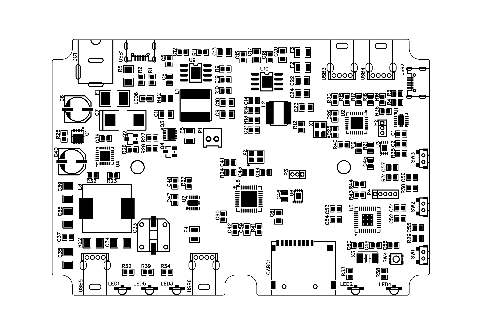

This project evolved from being just an idea to a complete prototype design. Within the repository, I will include schematics, board views and also firmware sources with USB-HID driver apps to control some of the device's features from the user operating system.

## Introduction

**narvi** (*/ˈnɑːrvi/*) is a device that allows sharing any USB enabled devices (like a keyboard, mice, serial port interface, etc.) and provides an integrated microSD card reader for the host device within just a tiny form factor. Additionally, it features a QuickCharge 3.0 front interface and an LED strip connector (for desk lighting or anything else).

This idea evolved from the daily usage of a Macbook next to a desktop PC. To manually switch keyboard and mice connections is almost always a pain in the ass. Narvi eliminates those annoyances and allows to switch the host connection with just a button press. On top of that, it features a QuickCharge 3.0 capable interface for charging up your smartphone.

## Hardware

The device's hardware consists of the following main components:

- **TPS54229** – Buck Converter ICs that provide both 5V and 3.3V rails for the entire device. The 5V rail supplies each device that is connected through the USB ports,
- **TS3USB221** – USB Switch ICs providing the host-switch capability,
- **GL850G** – Main USB Hub Controller with supplied EEPROM on-board to customize its properties,
- **USB2241** – MicroSD Card Reader Controller,
- **IP6518** – Front USB Quick Charge 3.0 Compatible Controller,
- **STM32F103T8U6** – Brain of the device. The integrated USB controller is directly connected to the main USB hub controller.

For a more detailed view on the hardware, schematics, memory maps, and pcb designs take a look at the hardware [README](hardware/README.md).

## Software

Yeet? :nerd_face:

## License

This work is licensed under a <a rel="license" href="http://creativecommons.org/licenses/by-nc/4.0/">Creative Commons Attribution-NonCommercial 4.0 International License</a>.

