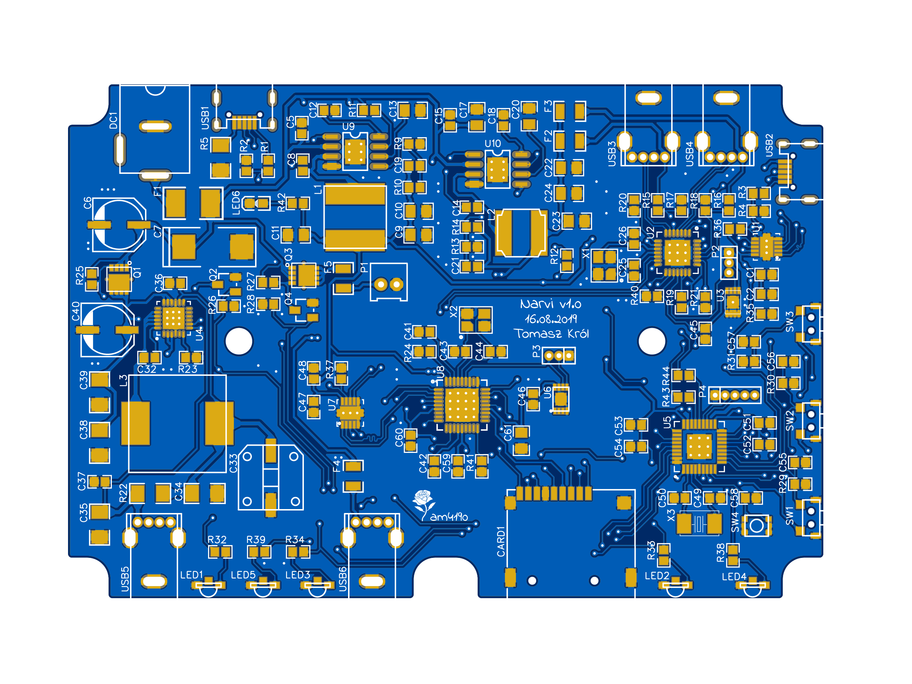
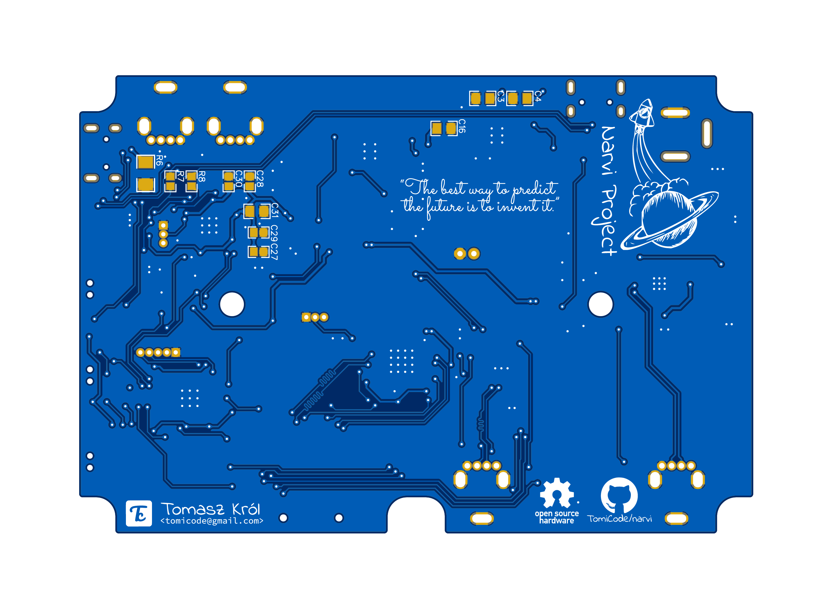

# Hardware
Ah, yes the hardware. If you are looking for schematics, then click [here](schematic_narvi_v1.0.pdf). For gerbers and other stuff, please contact me (unless I already uploaded it). Alright now low and behold, for my precious renders.

I'm not a professional pcb designer nor have I any expierience, but the layout was primarly focused on creating zones with components, rather than scathering it allover the place.

Bottom side looks quite empty with only few components, decoupling capacitors for the most part, but it helps alot with soldering.

## Memory maps for EEPROM Configurations

Some controller ICs that are used in this project have additionally memory chips connected to customize their behavior and/or settings. Bellow I provide a summary for some of them, what properties they've got and what layout they use.

### GL850G 

Let's start with the USB Hub IC, finding a specification about the memory layout was a pain in the butt. Only few of the sources I found online could tell what properties were defined, and how the fields should be aligned.

The first 16 bytes of data consists of the following content:

- VID & PID – Vendor ID, Product ID to distinguish between other devices
- PID – Product ID
- CHKSUM – Checksum of the previous fields, the chip refuses to load eeporm settings having this field wrong. The valid sum is calculated as follows:  `VID_H + VID_L + PID_H + PID_L + 1`
- PORT REMOVABLE – Bitfield allowing to specify which of the USB ports are internal, nonremovable (`0`) or removable (`1`). Ports are defined like this: `| - | - | - | PORT4 | PORT3 | PORT2 | PORT1 | - |` 
- PORT NUM – Number of connected ports, value needs to be `1 – 4`. 
- MAX PWR – Specifies the maximum power consumption in range from 0 mA – 500 mA with a 2 mA unit (`0x00 – 0xFA`)

Next fields in the eeprom memory are strings values with preceding lenghts (8 bit). Vendor and Product information are at most 46 bytes long and the Serial field only 14 bytes.

All other fields, reserved or unused should have a value of `0xFF` as a default.